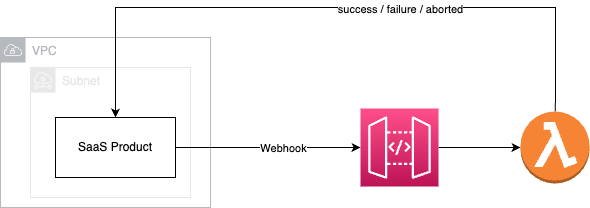

# Showcase: Async vs Sync invoking Lambda functions from API gateway

Inspired by the question "why should I invoke a lambda function in async mode, or even include a SQS queue behind an API gateway", I decided to build that showcase to, on one side, verify my hypothesis, and on the other side, to show case the setup.

To give a bit more context: The setup includes a SaaS product (A) working heavily with events and running in a Kubernetes Cluster on AWS, and a new service built from scratch (B) to handle webhooks of the SaaS product. There was a discussion sparked about implementation details of B and why, or why not, it would make sense to decouple the response to the webhook initiated by A.
A requires events about the processing state. Those include `“success”, “failed”, “aborted”`.

The definition of a webhook is as follows

> A webhook can be thought of as a type of API that is driven by events rather than requests. [Source](https://www.mparticle.com/blog/apis-vs-webhooks/)

To show case, the setup, following steps are taken

- Create API Gateway
- Create a Lambda function waiting 5 seconds and resolving
- Create a Lambda function waiting 3 seconds and rejecting
- Attach the lambda functions to
  - `POST /async/resolve` & `POST /async/reject`
  - `POST /sync/resolve` & `POST sync/reject`
- Create 4 lambda functions invoking the API, one for each method
- Optional: Pack in VPC
- Provide a cost estimation
